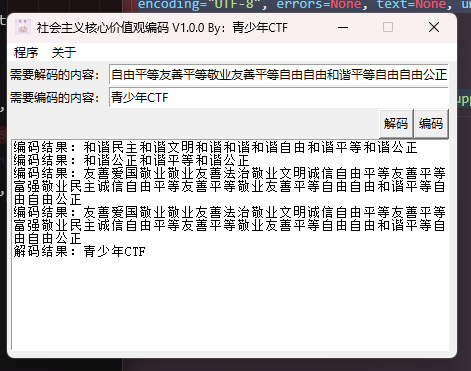
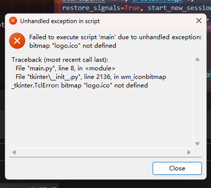

# 关于
这是一个由青少年CTF开发的社会主义核心价值观编码和解码的GUI工具，支持`离线`操作，无需联网。



# 原理
使用`tkinter`设计了UI界面，使用`qsnctf`库中的社会主义核心价值观编码（Chinese_socialism）进行编解码。

# 使用
## Python原生方法
如果您拥有Python环境，请按照如下方法使用：
### Step1.安装依赖
您只需要安装一次依赖，以后就可以在本地电脑使用。
```bash
pip install -r requirements.txt
```
假如您因为一些原因访问默认源较慢，可以使用：
```bash
pip install -r requirements.txt -i https://pypi.tuna.tsinghua.edu.cn/simple
```
### Step2.运行
```bash
python main.py
```

## 使用已经构建好的程序

我们会使用`pyinstaller`构建一个程序，这将发布到存储库的Release中，使用Release你可以查看我们是否打包了某个环境，也可以查看我们是否更新了更新的版本。

## 自己为自己打包程序

我们的设备不能完全满足大众的需要，我们只会构建我们现有设备的程序包，如AMD64的Linux、Windows和ARM版本的MacOs，所以假设您需要打包自己的程序，可以使用下面的命令来进行：
```
pip install -r requirements.txt
pip install -r requirements_build.txt
python3 -m PyInstaller main.spec
```

**请注意修改spec文件里qsnctf库的地址！**

参考文章：https://mp.weixin.qq.com/s?__biz=MzI2MzEwNTY3OQ==&mid=2648984914&idx=1&sn=61d24d8a1004e5a5c0c4fe886caac7b3&chksm=f25010b2c52799a431ce988cbb8b351a4076baca7bdbab355eb5e336a970840d4eb206711a61&scene=27

**真的很麻烦，如果不想麻烦，还是使用打包好的吧！！**

# BUG解释

## 锟斤拷

在部分版本的Python中的Execjs里，有一些令人匪夷所思的代码，这些代码会出现“锟斤拷”、“锟叫城”错误，如果你也遇到了这样的问题，请将Python根目录下的`\Lib\subprocess.py`文件中下面这一段修改：

```python
def __init__(self, args, bufsize=-1, executable=None,
                 stdin=None, stdout=None, stderr=None,
                 preexec_fn=None, close_fds=True,
                 shell=False, cwd=None, env=None, universal_newlines=None,
                 startupinfo=None, creationflags=0,
                 restore_signals=True, start_new_session=False,
                 pass_fds=(), *, user=None, group=None, extra_groups=None,
                 encoding=None, errors=None, text=None, umask=-1, pipesize=-1,
                 process_group=None):
```

将其中的encoding=None修改为UTF-8，可直接用下面的替换：

```python
def __init__(self, args, bufsize=-1, executable=None,
                 stdin=None, stdout=None, stderr=None,
                 preexec_fn=None, close_fds=True,
                 shell=False, cwd=None, env=None, universal_newlines=None,
                 startupinfo=None, creationflags=0,
                 restore_signals=True, start_new_session=False,
                 pass_fds=(), *, user=None, group=None, extra_groups=None,
                 encoding=None, errors=None, text=None, umask=-1, pipesize=-1,
                 process_group=None):
```

因为Python版本不同，所在行数也不同，我举例如下，不代表真实行数：

Python3.11：807-815行。

Python3.10：758-765行。

**如果使用我们已经构建好的程序，一般是不会出现这样的错误，如果仍然出现，请与我反馈！您可直接提交Issues，我们会安排人定期查看。**

## logo.ico



因为我引用了Logo文件，所以如果您将logo.ico删掉是会由tk报错的哦！请您加上我们的logo，非常感谢！

## 其他

如果有其他报错问题，可以提交Issues给我们进行反馈哦。
